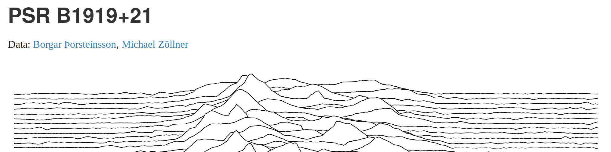
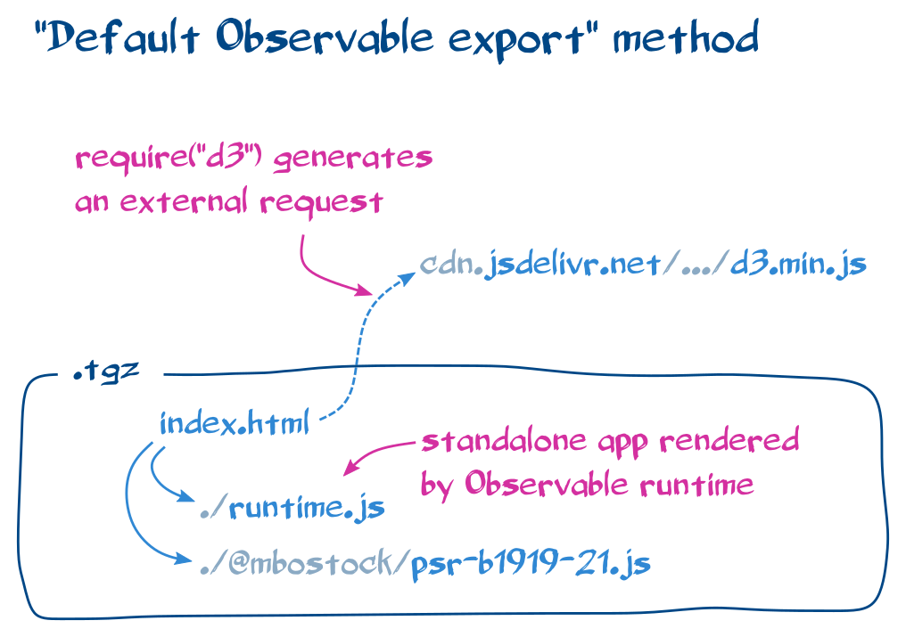
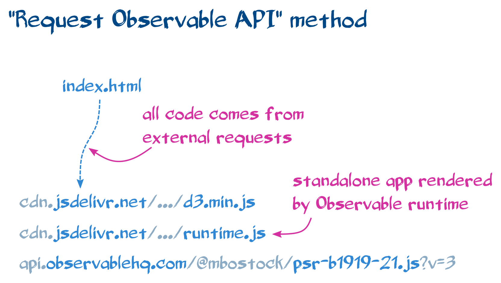
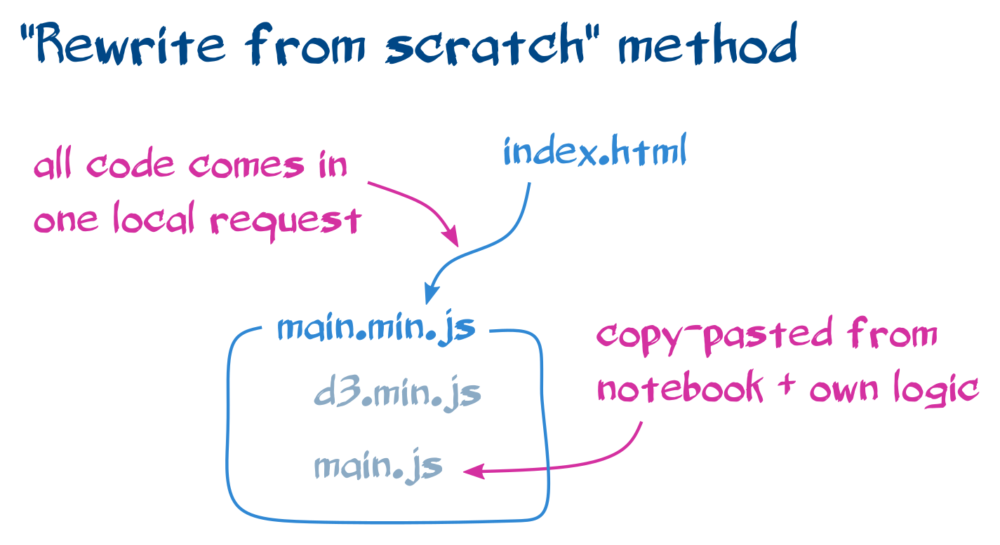

# Observable notebook to standalone application

Various methods to migrate an [Observable](https://observablehq.com) notebook to
a standalone webpage.

## Example notebook

The [joyplot notebook](https://observablehq.com/@mbostock/psr-b1919-21) is used
as an example throughout this repository.

Examine the results of the migration to a standalone application:

- [standalone joyplot](https://joyplot-8a5ibi1av.now.sh/) using the
  ["Bundle" method](./bundle)
- [standalone joyplot](https://joyplot-10jbhd7e8.now.sh/) using the simpler
  ["Default Observable export" method](./default_observable_export).
- [standalone joyplot](https://joyplot-96iun3ktp.now.sh/) using the simpler
  ["Request Observable API" method](./request_observable_api).
- [standalone joyplot](https://joyplot-p9qmx1pf3.now.sh/) using the
  ["Rewrite from scratch" method](./rewrite_from_scratch).

## Using ObservableHQ runtime

An Observable notebook can be run as a standalone application using the
[`@observable/runtime` library](https://github.com/observablehq/runtime),
outside of the Observable platform.

The recommended method is to bundle all the modules into a single JavaScript
file: ["Bundle" method](./bundle)

See it in action by Philippe Rivière on the Spherical contours notebook:

- [Original notebook](https://observablehq.com/@fil/spherical-contours) [@observablehq]
- [Prepared notebook](https://observablehq.com/@fil/standalone-app-notebook) [@observablehq]
- [Self-contained project](https://github.com/Fil/SphericalContoursStandalone) [@github]
- [Self-contained app](https://sphericalcontoursstandalone.fil.now.sh/) [@now.sh]

Two more simpler methods are possible. The first one is to download and extract
tgz from Observable notebook to use the default index.html file provided in the
tgz file: ["Default Observable export" method](./default_observable_export)

The second simpler method is to get JavaScript modules from api.observablehq.com
at runtime: ["Request Observable API" method](./request_observable_api)

## Independent of ObservableHQ runtime

A totally different approach to migrate an Observable notebook to a standalone
application is to rewrite the code from scratch:
["Rewrite from scratch" method](./rewrite_from_scratch)

## References

- ["How-To… Embed an Observable Notebook in your CMS"](https://visionscarto.net/observable-jekyll/):
  notebook cells embedded into a Jekyll blog,
- [Downloading and Embedding Notebooks](https://observablehq.com/@observablehq/downloading-and-embedding-notebooks):
  official Observable documentation,
- [zzzev/observable-press: An opinionated way to publish Observable (observablehq.com) notebooks](https://github.com/zzzev/observable-press):
  an untested alternative method.

## Credits

Project realized for [LIRIS M2i](https://projet.liris.cnrs.fr/mi2/) by Sylvain
Lesage with the help of Philippe Rivière, Romain Vuillemot and Mike Bostock.
