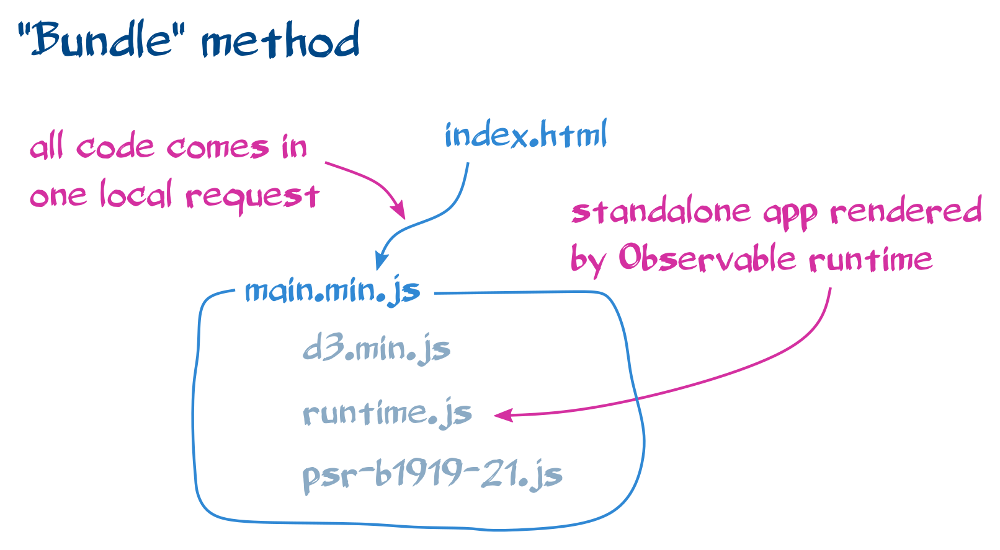

# Method - Bundle

This method allows to generate fewer requests than the
["Request Observable API" method](../request_observable_api/README.md), but is
more complicated since it requires to manage more files and concepts.



## TL;DR

This tutorial gives details about every step. Go to
[Standalone App Notebook](https://github.com/Fil/SphericalContoursStandalone/)
or [joyplot/](./joyplot/) for the direct solution.

Basic usage:

- first install

  ```bash
  cd joyplot
  npm run build
  ```

- run locally

  ```bash
  npm run serve
  ```

- deploy on now.sh (see https://joyplot-ag4zeux4u.now.sh/):

  ```bash
  npm run deploy
  ```

Advanced usage:

- update the notebook:

  ```
  npm run notebook
  ```

- update the data:

  ```
  npm run data
  ```

- remove the temporary files:

  ```
  npm run clean
  ```

## Pros

- generates fewer HTTP requests (the Observable notebook, the
  [runtime.js](https://cdn.jsdelivr.net/npm/@observablehq/runtime@4/dist/runtime.js)
  Observable library and all the "dynamic dependencies" are bundled in a
  minified [public/main.min.js](./joyplot/step6/public/main.min.js) JavaScript
  file)
- allows to render only some cells of the notebook
- supports old browser thanks to Babel (does not require browser
  [compatibility with ES modules](https://developer.mozilla.org/en-US/docs/Web/JavaScript/Reference/Statements/import#Browser_compatibility))
- CSV data is downloaded from GitHub, so that the application runs offline.

## Cons

- complex: requires knowledge about npm, node.js, ES modules, now.sh, rollup,
  babel, terser...

## Tutorial

This tutorial will lead to successive versions of the standalone webpage, with
additional features in each step.

### Step 1 - setup a npm package

The first step gives code similar to the
["request Observable API" method](../request_observable_api/README.md), but with
some of the modules retrieved locally (the notebooks).

- Install [node.js and npm](https://nodejs.dev/how-to-install-nodejs)
- Create a new npm project:

  ```bash
  mkdir joyplot
  cd joyplot
  npm init
  ```

  ```
  package name: (joyplot)
  version: (1.0.0)
  description:
  entry point: (index.js)
  test command:
  git repository:
  keywords:
  author:
  license: (ISC)
  About to write to /[...]/joyplot/package.json:

  {
    "name": "joyplot",
    "version": "1.0.0",
    "description": "",
    "main": "index.js",
    "scripts": {
      "test": "echo \"Error: no test specified\" && exit 1"
    },
    "author": "",
    "license": "ISC"
  }

  Is this OK? (yes)
  ```

- Install the notebook as a development dependency (the URL is obtained on the
  notebook page, clicking on "…" and then on "Download tarball"):

  ```bash
  mkdir -p vendor/
  curl -o vendor/notebook.tgz https://api.observablehq.com/@mbostock/psr-b1919-21.tgz?v=3
  npm install --save-optional aaa_notebook@file:vendor/notebook.tgz
  ```

  Note that it's exactly the same as the
  ["default Observable export" method](../default_observable_export/README.md):
  the same .tgz file is downloaded.

  Note that the
  `npm install --save-optional observable_notebook@file:vendor/notebook.tgz`
  command has created the `node_modules/` directory and extracted the tgz file
  to `node_modules/aaa_notebook`.

  Note also that it created

  ```json
  "optionalDependencies": {
    "aaa_notebook": "file:vendor/notebook.tgz"
  }
  ```

  in package.json. This way, if `npm install` is launched in a fresh version of
  this repository, the notebook package will not be installed. It's OK because
  the vendor/notebook.tgz would not be available at this stage.
  `npm run notebook` would then install it.

- Let's add a script to automate this each time we want to update the notebook
  to a new version:

  ```json
  "scripts": {
    "notebook": "rm -f vendor/notebook.tgz && mkdir -p vendor && curl -o vendor/notebook.tgz $npm_package_custom_notebook && npm install --save-dev aaa_notebook@file:vendor/notebook.tgz",
    "test": "echo \"Error: no test specified\" && exit 1"
  },
  "custom": {
    "notebook": "https://api.observablehq.com/@mbostock/psr-b1919-21.tgz?v=3"
  },
  ```

  try it with:

  ```bash
  npm run notebook
  ```

* Install the Observable runtime module:

  ```bash
  npm install --save-dev @observablehq/runtime@4
  ```

* Create src/index.html file with the following content:

  ```html
  <!DOCTYPE html>
  <html lang="en">
    <head>
      <!-- Minimal HTML head elements -->
      <meta charset="utf-8" />
      <title>PSR B1919+21</title>
    </head>
    <body>
      <!-- Title of the page -->
      <h1>PSR B1919+21</h1>

      <!-- Empty placeholders -->
      <div id="joyplot"></div>

      <!-- JavaScript code to fill the empty placeholders with notebook cells
           Note that the script is not vanilla JavaScript but an ES module
           (type="module")
        -->
      <script type="module" src="./main.js"></script>
    </body>
  </html>
  ```

* create the src/main.js file with the following content:

  ```js
  // Import Observable notebook
  // Note the relative path via ./node_modules - it's not optimal and will
  // be improved in the next steps
  import notebook from './node_modules/@mbostock/psr-b1919-21/@mbostock/psr-b1919-21.js';

  // Import Observable library
  // Same observation
  import {
    Runtime,
    Inspector,
  } from './node_modules/@observablehq/runtime/dist/runtime.js';

  // Render selected notebook cells into DOM elements of this page
  const runtime = new Runtime();
  const main = runtime.module(notebook, name => {
    switch (name) {
      case 'chart':
        // render 'chart' notebook cell into <div id="joyplot"></div>
        return new Inspector(document.querySelector('#joyplot'));
        break;
    }
  });
  ```

* install a webserver:

  ```bash
  npm install --save-dev http-server@0
  ```

  add the script to package.json:

  ```json
  "serve": "http-server ./",
  ```

  and serve with

  ```bash
  npm run serve
  ```

  Open http://127.0.0.1:8080/src/.

### Step 2 - bundle JS modules in one file

In step 1, 3 local requests are made for main.js, psr-b1919-21.js and
runtime.js. Moreover, the web server needs to be serving the "technical"
node_modules/ directory, that normally should be reserved for development and
build.

Instead, we will generate a single ES module, concatenating all the modules
using [rollup.js](https://rollupjs.org).

- the sources (src/ directory) will be compiled to a new directory (public/):

  ```bash
  mkdir public
  ```

- install rollup as a development dependency:

  ```bash
  npm install --save-dev rollup@1
  ```

- install rollup-plugin-node-resolve to tell rollup to search the modules inside
  the node_modules/ directory:

  ```bash
  npm install --save-dev rollup-plugin-node-resolve@5
  ```

- create the rollup.config.js configuration file for rollup:

  ```js
  import * as meta from './package.json';
  import resolve from 'rollup-plugin-node-resolve';

  const onwarn = function(warning, warn) {
    if (warning.code === 'CIRCULAR_DEPENDENCY') {
      return;
    }
    warn(warning);
  };
  const output = {
    file: `public/main.js`,
    name: '${meta.name}',
    format: 'iife',
    indent: false,
    extend: true,
    banner: `// ${meta.homepage} v${
      meta.version
    } Copyright ${new Date().getFullYear()} ${meta.author.name}`,
  };

  export default {
    input: 'src/main.js',
    onwarn: onwarn,
    output: output,
    plugins: [resolve()],
  };
  ```

  It tells rollup to take the src/main.js file as the source, to find the
  dependencies (`import` statements), and to concatenate them all into
  public/main.js.

- add the following script to package.json file to builds the public/main.js
  file and copy index.html:

  ```json
  "build": "rollup -c && cp src/index.html public/",
  ```

- adapt the src/main.js file to remove the relative paths since
  rollup-plugin-node-resolve will take care of finding the modules:

  ```js
  // Import Observable notebook
  import notebook from 'aaa_notebook';

  // Import Observable library
  import {Runtime, Inspector} from '@observablehq/runtime';
  ```

- build the file:

  ```bash
  npm run build
  ```

- configure the webserver to use public/ instead of src/:

  ```json
  "serve": "http-server public/",
  ```

  serve with

  ```bash
  npm run serve
  ```

  and access with http://127.0.0.1:8080/.

### Step 3 - Bundle dynamically loaded modules

In step 2, the bundled module helps to save three requests, but it doesn't help
with the remaining requests done at runtime to other dependencies (here
d3.min.js, that is downloaded from jsdelivr.net). In this step, let's declare
these dependencies statically (via import statements) and embed them into the
bundle.

- exploring the [notebook](https://observablehq.com/@mbostock/psr-b1919-21), we
  see that it requires "d3@5". This information is also present in the last cell
  declaration in
  [src/notebook/@mbostock/psr-b1919-21.js](./joyplot/step3/src/notebook/@mbostock/psr-b1919-21.js):

  ```js
  main.variable(observer('d3')).define('d3', ['require'], function(require) {
    return require('d3@5');
  });
  ```

  or analyzing the requests in the browser developer tools.

- install this dependency as a development dependency. Take care of installing
  the exact same version (see [npm-semver](https://docs.npmjs.com/misc/semver)
  for more details on how to specify the npm packages versions):

  ```bash
  npm install --save-dev d3@5.x
  ```

- import it in main.js:

  ```js
  // Import d3
  import * as d3 from 'd3';
  ```

- now install d3-require. It will be used to override the normal way
  Observable's runtime dynamically gets access to the dependencies:

  ```bash
  npm install --save-dev d3-require@1
  ```

- import d3-require in src/main.js. Also import the `Library` object from
  @observablehq/runtime.

  ```js
  // Import d3-require
  import {require} from 'd3-require';

  // Import Observable library
  import {Runtime, Inspector, Library} from '@observablehq/runtime';
  ```

- override the resolve function in runtime, when the module to resolve is
  "d3@5", replacing

  ```js
  // Render selected notebook cells into DOM elements of this page
  const runtime = new Runtime();
  ```

  by

  ```js
  // Resolve "d3@5" module to current object `d3`
  // Be careful: the 'd3@5' alias must be *exactly* the same string as in your
  // notebook cell, `d3 = require("d3@5")` in our case. Setting 'd3' or
  // 'd3@5.11.0' would not work
  const customResolve = require.alias({'d3@5': d3}).resolve;

  // Render selected notebook cells into DOM elements of this page
  // Use the custom resolve function to load modules
  const runtime = new Runtime(new Library(customResolve));
  ```

- build and launch with:

  ```bash
  npm run build && npm run serve
  ```

  Tip: to build automatically when running the server, add the following script
  to package.json:

  ```json
  "preserve": "npm run build",
  ```

  and just call:

  ```bash
  npm run serve
  ```

- taking advantage of the modules, let's split the src/main.js:

  - src/main.js

    ```js
    // Import Observable notebook
    import notebook from 'aaa_notebook';
    import {render} from './render';

    render(notebook);
    ```

  - src/render.js

    ```js
    // Import Observable library
    import {Runtime, Inspector, Library} from '@observablehq/runtime';
    import {customResolve} from './customResolve';

    // Load modules locally
    const runtime = new Runtime(new Library(customResolve));

    // Render selected notebook cells into DOM elements of this page
    export function render(notebook) {
      runtime.module(notebook, name => {
        switch (name) {
          case 'chart':
            // render 'chart' notebook cell into <div id="joyplot"></div>
            return new Inspector(document.querySelector('#joyplot'));
            break;
        }
      });
    }
    ```

  - src/customResolve.js

    ```js
    import {require} from 'd3-require';
    import * as d3 from 'd3';

    // Resolve "d3@5" module to current object `d3`
    // Be careful: the 'd3@5' alias must be *exactly* the same string as in your
    // notebook cell, `d3 = require("d3@5")` in our case. Setting 'd3' or
    // 'd3@5.11.0' would not work
    export const customResolve = require.alias({
      'd3@5': d3,
    }).resolve;
    ```

### Step 4 - serve the data locally

In the previous step, everything is loading locally, except the pulsar.csv file
that is accessed from gist.githubusercontent.com. Let's download the data and
serve them locally (this part has been developed first in
[Fil/SphericalContoursStandalone](https://github.com/Fil/SphericalContoursStandalone)
and added later to this tutorial for completeness).

- create a directory for the local data:

  ```bash
  mkdir -p public/data
  ```

- download the data:

  ```bash
  curl -o public/data/pulsar.csv https://gist.githubusercontent.com/borgar/31c1e476b8e92a11d7e9/raw/0fae97dab6830ecee185a63c1cee0008f6778ff6/pulsar.csv
  ```

- edit the code to make the `fetch` function download the data locally:

  - src/render.js: add

    ```
    import {customFetch} from './customFetch';

    // Fetch data locally
    fetch = customFetch;
    ```

  - src/customFetch.js:

    ```js
    const fetchAlias = {
      'https://gist.githubusercontent.com/borgar/31c1e476b8e92a11d7e9/raw/0fae97dab6830ecee185a63c1cee0008f6778ff6/pulsar.csv':
        'data/pulsar.csv',
    };

    // intercept and reroute calls
    const _fetch = fetch;
    export function customFetch() {
      const a = arguments;
      if (a[0] in fetchAlias) a[0] = fetchAlias[a[0]];
      return _fetch(...a);
    }
    ```

- check that the data is loaded locally:

  ```js
  npm run serve
  ```

In order to be more generic, let's define the map between URL and local file
only once:

- create src/fetchAlias.json

  ```json
  {
    "https://gist.githubusercontent.com/borgar/31c1e476b8e92a11d7e9/raw/0fae97dab6830ecee185a63c1cee0008f6778ff6/pulsar.csv": "data/pulsar.csv"
  }
  ```

- edit src/customFetch.js

  ```js
  import {default as fetchAlias} from './fetchAlias.json';

  // intercept and reroute calls
  const _fetch = fetch;
  export function customFetch() {
    const a = arguments;
    if (a[0] in fetchAlias) a[0] = fetchAlias[a[0]];
    return _fetch(...a);
  }
  ```

- install rollup-plugin-json to allow this way to import json directly:

  ```bash
  npm install --save-dev rollup-plugin-json@4
  ```

- adapt rollup.config.js

  ```js
  import json from 'rollup-plugin-json'

  plugins: [resolve(), json()],
  ```

- add a node utility to download the data locally:

  - create bin/download-data.js

    ```js
    #! /usr/bin/env node
    const request = require('request');
    const fs = require('fs');
    const fetchAlias = require('../src/fetchAlias.json');
    const DIR = './public';

    for (const url of Object.keys(fetchAlias)) {
      const filename = `${DIR}/${fetchAlias[url]}`;
      console.warn(`download ${filename} from ${url}`);
      request(url).pipe(fs.createWriteStream(filename));
    }
    ```

  - install the required packages:

    ```bash
    npm install --save-dev request@2
    ```

  - register the script as a binary in package.json

    ```json
    "bin": {
      "download-data": "bin/download-data.js"
    },
    ```

  - add a script in package.json to download or update the data

    ```json
    "data": "rm -rf public/data && mkdir -p public/data && node bin/download-data.js",
    ```

  - test it with:

    ```bash
    npm run data
    npm run serve
    ```

### Step 5 - support old browsers

As all the required modules have been bundled into one file (public/main.js), we
are able to apply transpilation to it, so that old browsers will be able to run
the JavaScript as well.

- install [babel](https://babeljs.io/) and
  [rollup-plugin-babel](https://github.com/rollup/rollup-plugin-babel) plugin

  ```bash
  npm install --save-dev @babel/core@7 rollup-plugin-babel@4
  ```

- adapt rollup.config.js:

  ```js
  //...
  import babel from 'rollup-plugin-babel';
  //...
    plugins: [resolve(), json(), babel()],
  //...
  ```

- adapt public/index.html to remove `type="module"`, since the code has been
  transpiled to non-module format

  ```html
  <!-- JavaScript code to fill the empty placeholders with notebook cells -->
  <script src="./main.js"></script>
  ```

- check

  ```bash
  npm run serve
  ```

### Step 6 - minimize JavaScript code

Additionally we can minimize the size of the JS bundle:

- install the terser plugin

  ```bash
  npm install --save-dev rollup-plugin-terser@5
  ```

- adapt rollup.config.js:

  ```js
  import {terser} from 'rollup-plugin-terser';
  // ...
    output: {...output, file: `public/main.min.js`, sourcemap: true},
    plugins: [resolve(), json(), babel(), terser()],
  // ...
  ```

  Note that we changed the name of the generated js file, and that we instruct
  rollup to produce the
  [sourcemap](https://developer.mozilla.org/en-US/docs/Tools/Debugger/How_to/Use_a_source_map)
  in order to allow debugging the minified code.

* adapt public/index.html to change the JavaScript filename

  ```html
  <script src="./main.min.js"></script>
  ```

* build and launch with:

  ```bash
  rm public/main.js # Obsolete file
  npm run serve
  ```

The file size is 292KB, whereas the original bundle was 592KB and the transpiled
one (with polyfills to support old browsers) was 596KB.

### Step 7 - publish online

In the previous step, the final files are made available in the public/
directory, but there is still a need to configure hosting to publish them
online. There are various solutions to help publish from the cli, let's see one
of them: [now.sh](https://now.sh).

- install "now" as a development dependency:

  ```bash
  npm install --save-dev now@16
  ```

- add a npm script to package.json to deploy to the now.sh hosting
  infrastructure:

  ```json
  "deploy": "now",
  ```

- deploy on now.sh hosting:

  ```bash
  npm run deploy
  ```

- open the now.sh URL in a browser (for example:
  https://joyplot-ag4zeux4u.now.sh/)

Note that it works only because the we already downloaded the data and notebook,
and the `now` command uploaded the vendor/, public/ an public/data/ directories.
Let's automate it a little bit:

- rename the `build` script in package.json:

  ```json
  "build:light": "rollup -c && cp src/index.html public/",
  "preserve": "npm run build:light",
  ```

- add the `build` script where the notebook is installed first, and the data is
  downloaded, before building the application:

  ```json
  "build": "npm run notebook && npm run data && npm run build:light",
  ```

- also add a `clear` script to remove the temporary files:

  ```json
  "clean": "rm -rf node_modules public vendor",
  ```

- test it from a fresh copy (we use `npx now` here to show that the deploy works
  without any of the following directories being present locally: node_modules,
  public, or vendor):

  ```
  npm run clean
  npx now
  ```

### Final code

The code can be found in [joyplot/](./joyplot/) directory.
